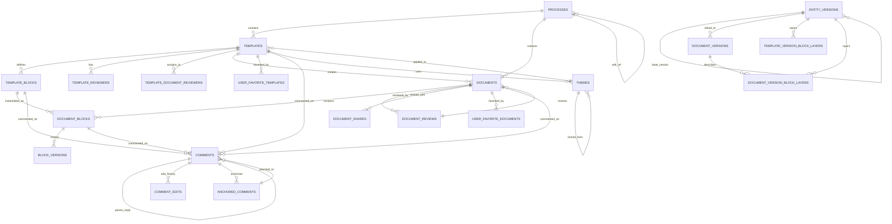

# ER — maya_dms

## Entity-Relationship Diagram

## Table Schemas

### processes
- **id** (uuid, PK)
- **code** (string[100], unique)
- **name** (string)
- **alias** (string)
- **icon** (string[40], nullable)
- **color** (string[7], nullable)
- **description** (text, nullable)
- **process_parent_id** (uuid, FK→processes.id, nullable, cascadeOnDelete)
- **created_at** (timestamp)
- **updated_at** (timestamp)

### templates
- **id** (uuid, PK)
- **process_id** (uuid, FK→processes.id, restrictOnDelete)
- **head_entity_version_id** (uuid, FK→entity_versions.id, restrictOnDelete)
- **theme_id** (uuid, FK→themes.id, restrictOnDelete, nullable)
- **created_at** (timestamp)
- **updated_at** (timestamp)
- **deleted_at** (timestamp, soft delete)

### template_blocks
- **id** (uuid, PK)
- **template_id** (uuid, FK→templates.id, cascadeOnDelete)
- **title** (string, nullable)
- **default_content** (json, nullable)
- **description** (text, nullable)
- **block_state** (enum: optional|editable|modifiable|locked)
- **sort_order** (integer)
- **created_at** (timestamp)
- **updated_at** (timestamp)
- **deleted_at** (timestamp, soft delete)

### template_reviewers
- **id** (uuid, PK)
- **template_id** (uuid, FK→templates.id, cascadeOnDelete)
- **user_id** (string, FK logical→users)
- **stage** (integer)
- **status** (string: pending|approved|rejected)
- **created_at** (timestamp)
- **updated_at** (timestamp)
- **deleted_at** (timestamp, soft delete)
- **Unique**: (template_id, user_id)

### template_document_reviewers
- **template_id** (uuid, FK→templates.id, cascadeOnDelete, part of PK)
- **user_id** (string, FK logical→users, part of PK)
- **stage** (integer)
- **created_at** (timestamp)
- **updated_at** (timestamp)
- **PK**: (template_id, user_id)

### documents
- **id** (uuid, PK)
- **process_id** (uuid, FK→processes.id, restrictOnDelete)
- **template_id** (uuid, FK→templates.id, restrictOnDelete)
- **template_version_id** (uuid, FK→entity_versions.id, restrictOnDelete, nullable)
- **head_entity_version_id** (uuid, FK→entity_versions.id, restrictOnDelete)
- **created_at** (timestamp)
- **updated_at** (timestamp)
- **deleted_at** (timestamp, soft delete)

### document_shares
- **id** (uuid, PK)
- **document_id** (uuid, FK→documents.id, cascadeOnDelete)
- **user_id** (string, FK logical→users)
- **permission** (string: read|edit)
- **granted_by** (string, FK logical→users)
- **created_at** (timestamp)
- **updated_at** (timestamp)
- **Unique**: (document_id, user_id)

### document_blocks
- **id** (uuid, PK)
- **document_id** (uuid, FK→documents.id, cascadeOnDelete)
- **template_block_id** (uuid, FK→template_blocks.id, restrictOnDelete)
- **content** (json, nullable)
- **content_legacy_blocknote** (json, nullable)
- **is_filled** (boolean)
- **last_edited_by** (string, FK logical→users, nullable)
- **locked_by** (string, FK logical→users, nullable)
- **locked_at** (timestamp, nullable)
- **sort_order** (integer)
- **created_at** (timestamp)
- **updated_at** (timestamp)
- **deleted_at** (timestamp, soft delete)
- **Unique**: (document_id, template_block_id)

### block_versions
- **id** (uuid, PK)
- **document_block_id** (uuid, FK→document_blocks.id, cascadeOnDelete)
- **document_id** (uuid, FK→documents.id, cascadeOnDelete)
- **version_number** (integer)
- **content** (json)
- **content_legacy_blocknote** (json, nullable)
- **diff** (json, nullable)
- **edited_by** (string, FK logical→users)
- **created_at** (timestamp)
- **Unique**: (document_block_id, version_number)

### document_versions
- **id** (uuid, PK)
- **document_id** (uuid, FK→documents.id, cascadeOnDelete)
- **entity_version_id** (uuid, FK→entity_versions.id, nullOnDelete, nullable)
- **version_number** (integer)
- **trigger_event** (string: submitted|published|rejected)
- **triggered_by** (string, FK logical→users)
- **snapshot_data** (json, nullable)
- **notes** (text, nullable)
- **is_immutable** (boolean)
- **created_at** (timestamp)
- **Unique**: (document_id, version_number)
- **Unique**: entity_version_id

### document_reviews
- **id** (uuid, PK)
- **document_id** (uuid, FK→documents.id, cascadeOnDelete)
- **reviewer_id** (string, FK logical→users)
- **stage** (integer)
- **status** (string: pending|approved|rejected)
- **rejection_reason** (text, nullable)
- **reviewed_at** (timestamp, nullable)
- **created_at** (timestamp)
- **updated_at** (timestamp)
- **Unique**: (document_id, reviewer_id)

### comments
- **id** (uuid, PK)
- **commentable_type** (string)
- **commentable_id** (uuid)
- **commentable_version** (integer)
- **blockable_type** (string, nullable)
- **blockable_id** (uuid, nullable)
- **parent_id** (uuid, FK→comments.id, nullable)
- **author_id** (string, FK logical→users)
- **body** (text)
- **created_at** (timestamp)
- **updated_at** (timestamp, nullable)
- **deleted_at** (timestamp, soft delete)
- **deleted_by** (string, FK logical→users, nullable)
- **deleted_by_name** (string, nullable)

### comment_edits
- **id** (uuid, PK)
- **comment_id** (uuid, FK→comments.id, cascadeOnDelete)
- **previous_body** (text)
- **edited_by** (string, FK logical→users)
- **edited_at** (timestamp)

### anchored_comments
- **id** (uuid, PK)
- **comment_id** (uuid, FK→comments.id, cascadeOnDelete, unique)
- **resource_type** (string[64])
- **resource_id** (uuid)
- **anchor_from** (unsigned integer)
- **anchor_to** (unsigned integer)
- **anchor_text_snapshot** (string[1000], nullable)
- **anchor_is_valid** (boolean)
- **anchor_last_synced_at** (timestamp, nullable)
- **created_at** (timestamp)
- **updated_at** (timestamp)

### entity_versions
- **id** (uuid, PK)
- **versionable_type** (string)
- **versionable_id** (uuid)
- **version_number** (unsigned integer)
- **base_version_id** (uuid, FK→entity_versions.id, nullOnDelete, nullable)
- **change_set** (json, nullable)
- **status** (string: draft|published|rejected|archived)
- **created_by** (string, FK logical→users)
- **published_by** (string, FK logical→users, nullable)
- **published_at** (timestamp, nullable)
- **changelog** (text, nullable)
- **snapshot_data** (json, nullable)
- **is_snapshot_immutable** (boolean)
- **created_at** (timestamp)
- **updated_at** (timestamp)
- **Unique**: (versionable_type, versionable_id, version_number)

### template_version_block_layers
- **entity_version_id** (uuid, FK→entity_versions.id, cascadeOnDelete, part of PK)
- **template_block_id** (uuid, part of PK)
- **sort_order** (unsigned integer)
- **inherits_from_previous_publication** (boolean)
- **removed** (boolean)
- **override_payload** (json, nullable)
- **created_at** (timestamp)
- **updated_at** (timestamp)
- **PK**: (entity_version_id, template_block_id)

### document_version_block_layers
- **document_version_id** (uuid, FK→document_versions.id, cascadeOnDelete, part of PK)
- **document_block_id** (uuid, part of PK)
- **sort_order** (unsigned integer)
- **inherits_from_previous_publication** (boolean)
- **removed** (boolean)
- **override_payload** (json, nullable)
- **created_at** (timestamp)
- **updated_at** (timestamp)
- **PK**: (document_version_id, document_block_id)

### permissions
- **code** (string[191], PK)
- **name** (string[255])
- **description** (text)
- **created_at** (timestamp)
- **updated_at** (timestamp)

### user_favorite_templates
- **user_id** (string, part of PK)
- **template_version_id** (uuid, FK→entity_versions.id, cascadeOnDelete, part of PK)
- **created_at** (timestamp)
- **updated_at** (timestamp)
- **PK**: (user_id, template_version_id)

### user_favorite_documents
- **user_id** (string, part of PK)
- **document_id** (uuid, FK→documents.id, cascadeOnDelete, part of PK)
- **created_at** (timestamp)
- **updated_at** (timestamp)
- **PK**: (user_id, document_id)

### themes
- **id** (uuid, PK)
- **name** (string)
- **description** (text, nullable)
- **status** (string[32]: draft|published|archived)
- **created_by** (string, FK logical→users)
- **team_id** (uuid, nullable)
- **palette** (json, nullable)
- **typography** (json, nullable)
- **layout** (json, nullable)
- **assets** (json, nullable)
- **accessibility** (json, nullable)
- **cloned_from_id** (uuid, nullable, FK→themes.id)
- **created_at** (timestamp)
- **updated_at** (timestamp)
- **deleted_at** (timestamp, soft delete)

## Foreign Key Summary

| Table | FK Column | References | Cascade |
|-------|-----------|-----------|---------|
| processes | process_parent_id | processes.id | nullOnDelete |
| templates | process_id | processes.id | restrictOnDelete |
| templates | head_entity_version_id | entity_versions.id | restrictOnDelete |
| templates | theme_id | themes.id | restrictOnDelete |
| template_blocks | template_id | templates.id | cascadeOnDelete |
| template_reviewers | template_id | templates.id | cascadeOnDelete |
| template_document_reviewers | template_id | templates.id | cascadeOnDelete |
| documents | process_id | processes.id | restrictOnDelete |
| documents | template_id | templates.id | restrictOnDelete |
| documents | template_version_id | entity_versions.id | restrictOnDelete |
| documents | head_entity_version_id | entity_versions.id | restrictOnDelete |
| document_shares | document_id | documents.id | cascadeOnDelete |
| document_blocks | document_id | documents.id | cascadeOnDelete |
| document_blocks | template_block_id | template_blocks.id | restrictOnDelete |
| block_versions | document_block_id | document_blocks.id | cascadeOnDelete |
| block_versions | document_id | documents.id | cascadeOnDelete |
| document_versions | document_id | documents.id | cascadeOnDelete |
| document_versions | entity_version_id | entity_versions.id | nullOnDelete |
| document_reviews | document_id | documents.id | cascadeOnDelete |
| comments | parent_id | comments.id | implicit (null) |
| comment_edits | comment_id | comments.id | cascadeOnDelete |
| anchored_comments | comment_id | comments.id | cascadeOnDelete |
| entity_versions | base_version_id | entity_versions.id | nullOnDelete |
| template_version_block_layers | entity_version_id | entity_versions.id | cascadeOnDelete |
| document_version_block_layers | document_version_id | document_versions.id | cascadeOnDelete |
| themes | cloned_from_id | themes.id | implicit (null) |
| user_favorite_templates | template_version_id | entity_versions.id | cascadeOnDelete |
| user_favorite_documents | document_id | documents.id | cascadeOnDelete |

## Discrepancies

- themes.cloned_from_id → No explicit FK in migration; model has `parent()` BelongsTo relation; will cause orphans if parent is deleted. Consider adding FK constraint in migration.
- comments.parent_id → No explicit FK in migration; model has `parent()` BelongsTo relation; will cause orphans if parent is deleted. Consider adding FK constraint in migration.

## Categoría de tablas

### Tablas FÍSICA (propias de maya_dms)

- **processes** — Definición de flujos y procesos
- **templates**, **template_blocks**, **template_reviewers**, **template_document_reviewers** — Gestión de plantillas
- **template_version_block_layers** — Versionado de capas de bloques en plantillas
- **documents**, **document_blocks**, **document_shares**, **document_versions**, **document_reviews** — Gestión de documentos
- **document_version_block_layers** — Versionado de capas de bloques en documentos
- **block_versions** — Historial de versiones de bloques
- **comments**, **comment_edits**, **anchored_comments** — Sistema de comentarios
- **entity_versions** — Base de versionado (polimórfica)
- **themes** — Temas visuales
- **permissions** — Definiciones de permisos
- **user_favorite_templates**, **user_favorite_documents** — Favoritos del usuario

### Tablas FDW Odoo (read-only, shared-profile)

%% FDW Odoo (read-only) — shared-profile

- **users** — FDW vivo (foreign table + pass-through view)
- **teams** — FDW vivo (foreign table + pass-through view)
- **team_members** — FDW vivo (foreign table + pass-through view)
- **study_types** — FDW vivo (foreign table + view filtrada)
- **studies** — FDW vivo (foreign table + view filtrada)
- **course_modules** — FDW vivo (2 foreign tables + view JOIN cross-FDW)
- **user_study_types** — FDW vivo (view materializada desde FDW res_company_users_rel)
- **user_studies** — FDW vivo (view materializada desde FDW + maya_core_study)
- **user_course_modules** — FDW vivo (view materializada desde FDW subject_employee_rel)
- **user_resolved_permissions** — Vista FDW (materializada desde maya_authorization, read-only)

### Auditoría de consumo FDW

| Entidad | Mecanismo | Correcto? | Evidencia |
|---------|-----------|----------|-----------|
| users | FDW vivo (foreign table + pass-through view) | ✓ | `shared-profile-laravel/database/migrations/users/2026_05_19_000001_create_users_foreign_table.php:136-143` |
| teams | FDW vivo (foreign table + pass-through view) | ✓ | `shared-profile-laravel/database/migrations/teams/2026_05_18_000001_create_teams_foreign_table.php:110-117` |
| team_members | FDW vivo (foreign table + pass-through view) | ✓ | `shared-profile-laravel/database/migrations/teams/2026_05_18_000002_create_team_members_foreign_table.php:104-111` |
| study_types | FDW vivo (foreign table + view filtrada) | ✓ | `shared-profile-laravel/database/migrations/academic-catalogs/2026_05_22_000000_create_study_types_catalog_foreign_table.php:87-93` |
| studies | FDW vivo (foreign table + view filtrada) | ✓ | `shared-profile-laravel/database/migrations/academic-catalogs/2026_05_22_000001_create_studies_catalog_foreign_table.php:115-122` |
| course_modules | FDW vivo (2 foreign tables + view JOIN cross-FDW) | ✓ | `shared-profile-laravel/database/migrations/academic-catalogs/2026_05_22_000002_create_course_modules_catalog_foreign_table.php:119-129` |
| user_study_types | FDW vivo (view materializada desde FDW res_company_users_rel) | ✓ | `shared-profile-laravel/database/migrations/academic-assignments/2026_05_18_000003_create_user_study_types_foreign_table.php:103-117` |
| user_studies | FDW vivo (view materializada desde FDW + maya_core_study) | ✓ | `shared-profile-laravel/database/migrations/academic-assignments/2026_05_18_000004_create_user_studies_foreign_table.php:107-124` |
| user_course_modules | FDW vivo (view materializada desde FDW subject_employee_rel) | ✓ | `shared-profile-laravel/database/migrations/academic-assignments/2026_05_18_000005_create_user_course_modules_foreign_table.php:111-125` |
| user_resolved_permissions | Vista FDW (maya_authorization, permisos resueltos) | ✓ | AppServiceProvider:184 `loadMigrationsFrom(ProfileMigrations::userPermissions())` |

### Duplicaciones y discrepancias

Ninguna. Todas las entidades Odoo se leen en vivo por FDW. Las columnas locales que referencian entidades Odoo (`study_type_id`, `study_id`, `module_id`, `created_by`, `owner_id` en `documents`, `templates`, `themes`) usan exclusivamente FK lógicas (strings sin constraint Postgres), compatible con foreign tables/vistas de Odoo. Los tipos de datos son correctos (VARCHAR/string para UUID-shaped Keycloak/Odoo ids). No existen tablas físicas `*_source` antiguas ni migraciones que las creen. La arquitectura FDW es limpia y centralizada en el paquete `shared-profile-laravel`.
