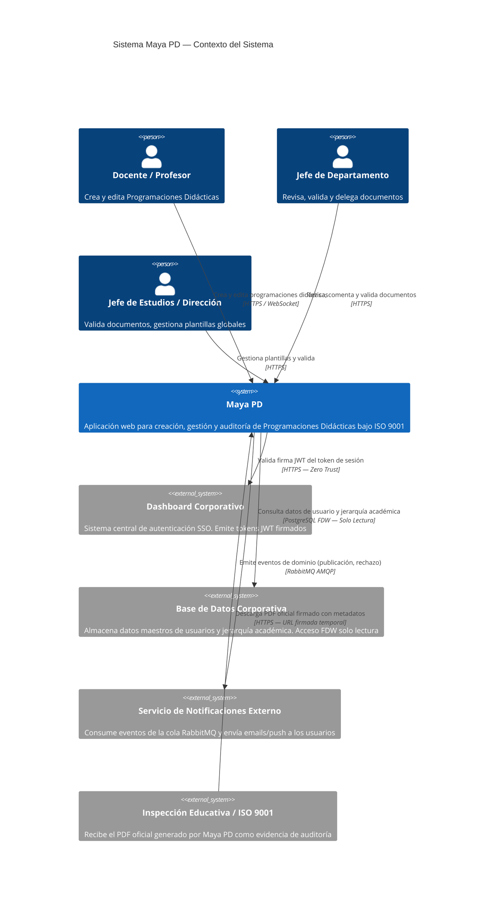
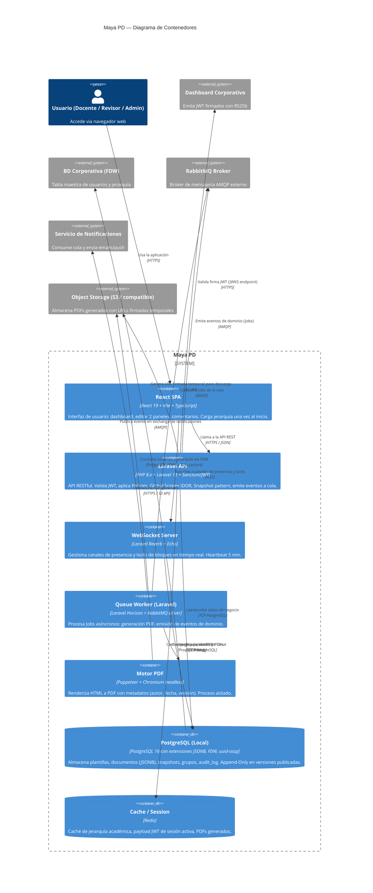

# 🏗️ Arquitectura y Riesgos — Maya PD (MAYA-PD-ISO9001)

**Fase:** 2 — Arquitectura y Riesgos
**Skill:** System Architect (Cloud Solutions Architect & Security Expert)
**Fecha:** 2026-03-30
**Frameworks:** C4 Model · STRIDE · OWASP Top 10 · The Twelve-Factor App
**Estado:** FASE 2 Completada — Pendiente aprobación

---

## 1. Diagramas C4 (Mermaid)

### 1.1 Nivel 1 — System Context Diagram



---

### 1.2 Nivel 2 — Container Diagram



---

## 2. Requisitos No Funcionales (NFRs)

### 2.1 Escalabilidad

| NFR | Especificación | Justificación |
|-----|---------------|---------------|
| **NFR-ESC-01** | La API Laravel debe soportar al menos 200 usuarios concurrentes sin degradación en tiempo de respuesta | Un centro educativo puede tener 50-200 profesores; pico en periodo de entrega de programaciones (enero/junio) |
| **NFR-ESC-02** | El patrón Snapshot en PostgreSQL debe mantener tiempos de query `SELECT * WHERE version_id = X` por debajo de 100 ms con hasta 10.000 snapshots | Decisión arquitectónica que descarta Git; validar con índices B-Tree sobre `(document_id, version)` |
| **NFR-ESC-03** | Los Jobs de generación PDF deben procesarse en cola: máximo 5 workers en paralelo para no saturar los recursos de Chromium headless | Chromium es pesado en memoria; escalar workers horizontalmente si crecen los centros |
| **NFR-ESC-04** | La caché Redis de jerarquía académica (Tipo Estudio → Estudio → Módulo) debe tener TTL de 1 hora con invalidación manual por admin | Los datos de jerarquía cambian raramente (inicio de curso); evita FDW queries repetidas |

### 2.2 Disponibilidad (SLAs)

| NFR | Especificación | Justificación |
|-----|---------------|---------------|
| **NFR-DIS-01** | **SLA objetivo: 99,5% uptime** en periodos de entrega activa (enero y junio); 99% el resto del año | Sistema Tier 1 — una caída durante entrega tiene impacto legal |
| **NFR-DIS-02** | Tiempo máximo de recovery (RTO): 4 horas; máxima pérdida de datos tolerable (RPO): 1 hora (backups PostgreSQL cada hora) | ISO 9001 exige trazabilidad; pérdidas de datos tienen implicaciones de auditoría |
| **NFR-DIS-03** | RabbitMQ en modo clustering con al menos 2 nodos en staging/producción para evitar pérdida de Jobs en cola | Los Jobs de PDF y notificaciones son críticos; no deben perderse en caída de un nodo |
| **NFR-DIS-04** | La aplicación debe degradarse con gracia si el servicio externo de notificaciones cae: los eventos se acumulan en la cola sin bloquear el flujo principal | Desacoplamiento real gracias a RabbitMQ |

### 2.3 Latencia

| NFR | Especificación | Justificación |
|-----|---------------|---------------|
| **NFR-LAT-01** | Respuesta HTTP de la API para endpoints de lectura (dashboard, listados): **< 300 ms** p95 | BFF endpoint del dashboard agrega múltiples consultas; requiere índices y caché Redis |
| **NFR-LAT-02** | Endpoint de envío a revisión / publicación: respuesta **< 50 ms** — el Job PDF se encola de forma asíncrona | Requisito explícito del Discovery: nunca bloquear al usuario esperando el PDF |
| **NFR-LAT-03** | Generación completa del PDF (Job en cola): **< 30 segundos** en p95 para documentos de hasta 50 bloques | Chromium headless puede tardar; optimizar con warmup de instancias |
| **NFR-LAT-04** | Consultas FDW a la BD corporativa: **< 200 ms** p95; usar caché Redis del payload JWT para evitar FDW queries en cada request | Las queries FDW cruzadas degradan si no se controla (Restricción 4) |
| **NFR-LAT-05** | Reconexión WebSocket tras desconexión: heartbeat cada **30 segundos**, liberación de lock tras **5 minutos** de inactividad | Garantía de experiencia colaborativa sin locks huérfanos |

### 2.4 Observabilidad

| NFR | Especificación | Justificación |
|-----|---------------|---------------|
| **NFR-OBS-01** | Logging estructurado en formato JSON en todos los componentes (API, Worker, WebSocket), exportable a ELK/Loki | ISO 9001 exige trazabilidad de operaciones |
| **NFR-OBS-02** | Eventos de negocio críticos logueados con nivel INFO: autenticación JWT, publicación documento, rechazo validación, generación PDF, errores de Job | Identificar anomalías de proceso rápidamente |
| **NFR-OBS-03** | Health check endpoints en `/health`: estado Laravel, PostgreSQL local, conexión FDW, RabbitMQ, Redis | Para monitoreo externo y alertas de oncall |
| **NFR-OBS-04** | Trazas distribuidas (Trace ID) en cabeceras HTTP propagadas de API a Worker (correlación entre request y Job) | Facilita debug de fallos en la generación PDF asíncrona |

---

## 3. Modelado de Amenazas — Análisis STRIDE

### Componentes críticos analizados

> Categorías seguidas de referencias a Features afectadas para trazabilidad directa con el backlog.

---

### 3.1 Middleware JWT / Capa de Autenticación
**Categoría:** `Security` · `Integration`
**Features afectadas:** F-01.1, F-01.2, F-01.4

| Vector | Amenaza | Severidad | Control Mitigador |
|--------|---------|-----------|-------------------|
| **S** Spoofing | Token JWT forjado o capturado/replicado desde otra sesión | 🔴 CRÍTICA | Validación de firma RS256 contra JWKS público del dashboard corporativo; validar `iss`, `aud`, `exp` en cada request |
| **T** Tampering | Claims del token alterados en tránsito (ej. elevar rol) | 🔴 CRÍTICA | Firma asimétrica RS256 hace imposible modificar sin clave privada; HTTPS obligatorio — sin plain HTTP |
| **R** Repudiation | Usuario niega haber realizado acción crítica (publicación, rechazo) | 🟠 ALTA | Audit Trail en tabla separada con `user_id` del JWT y timestamp de servidor; registrar IP y User-Agent |
| **I** Info Disclosure | Payload del token expone datos sensibles si se logea sin sanitizar | 🟡 MEDIA | Nunca loguear el token completo; solo loguear `sub` (user ID) y `exp`; headers JWT filtrados en logs |
| **D** DoS | Flood de requests con tokens inválidos satura validación criptográfica | 🟠 ALTA | Rate limiting por IP en el middleware antes de validación; circuit breaker para el JWKS endpoint |
| **E** Elevation of Privilege | Token con claims de rol inexistente eleva privilegios en Maya PD | 🔴 CRÍTICA | MVP usa Policies por usuario (`creator_id ≠ reviewer_id`), no por rol del token; en V2 validar roles contra whitelist |

**Decisión arquitectónica:** El JWKS endpoint del dashboard corporativo debe cachearse localmente (TTL: 1h) para evitar dependencia en tiempo real y resistir caídas del sistema externo.

---

### 3.2 FDW — Conexión a Base de Datos Corporativa
**Categoría:** `Integration` · `Data` · `Security`
**Features afectadas:** F-01.2, F-02.1, F-00.3

| Vector | Amenaza | Severidad | Control Mitigador |
|--------|---------|-----------|-------------------|
| **S** Spoofing | Suplantación del usuario FDW con credenciales robadas | 🔴 CRÍTICA | Credenciales FDW en variables de entorno cifradas (nunca en código); usuario FDW con permisos `SELECT` únicamente, sin `INSERT/UPDATE/DELETE` |
| **T** Tampering | SQL injection vía parámetros que llegan a query FDW | 🔴 CRÍTICA | Usar exclusivamente queries parametrizadas de Eloquent; nunca concatenar strings en queries que toquen FDW |
| **I** Info Disclosure | JOIN complejo entre tabla local y FDW expone datos de todos los usuarios | 🟠 ALTA | Restringir queries FDW a `WHERE user_id = ?` del token JWT; prohibir JOINs cruzados masivos (Restricción 4) |
| **D** DoS | Query FDW sin filtro `WHERE` hace full-scan de tabla remota, degrada BD corporativa | 🔴 CRÍTICA | Global Scope en el modelo User que siempre añade `WHERE id = :current_user_id`; query review en PR |
| **E** Elevation of Privilege | Error de configuración FDW permite escritura en BD corporativa | 🟠 ALTA | Verificar en deploy que el user FDW tiene solo `USAGE` en foreign schema y `SELECT` en tablas específicas |

---

### 3.3 API Laravel — Gestión de Documentos y Plantillas
**Categoría:** `Logic / Business` · `Data` · `Security`
**Features afectadas:** F-03.1–F-03.5, F-04.1–F-04.6, F-06.1–F-06.4

| Vector | Amenaza | Severidad | Control Mitigador |
|--------|---------|-----------|-------------------|
| **S** Spoofing | IDOR: usuario A modifica documento de usuario B pasando su ID en URL | 🔴 CRÍTICA | Global Scopes en todos los modelos: `Document::query()` siempre filtra por `accessible_to(auth()->user())`; nunca confiar en IDs del frontend |
| **T** Tampering | Modificación de documento publicado (estado Published) vía API directa | 🔴 CRÍTICA | Policy Laravel: `update` retorna `false` si `document->status === 'published'`; restricción Append-Only en BD |
| **T** Tampering | Inserción de HTML malicioso en bloques JSONB (XSS stored) | 🟠 ALTA | El editor BlockNote genera JSON estructurado, no HTML libre; validación de schema JSONB en backend (422 si estructura inválida); sanitización en la capa de renderizado React |
| **R** Repudiation | Revisor niega haber aprobado/rechazado un documento | 🟠 ALTA | Registro en `audit_log` de cada transición de estado con `reviewer_id`, timestamp servidor y hash del documento en ese momento |
| **I** Info Disclosure | Endpoint de listado retorna documentos de otros usuarios/departamentos | 🔴 CRÍTICA | Global Scope activo siempre; tests automatizados que verifican que user B no ve documentos de user A |
| **D** DoS | Búsqueda sin filtros sobre tabla de documentos con JSONB voluminoso | 🟠 ALTA | Búsqueda solo por metadatos indexados (B-Tree en `study_id`, `year`, `status`); prohibir queries sobre contenido JSONB sin filtro previo (Restricción 6) |
| **E** Elevation of Privilege | Usuario intenta aprobar su propio documento (violación SoD) | 🔴 CRÍTICA | Policy `ReviewDocumentPolicy`: `authorize('review', $doc)` retorna 403 si `$doc->creator_id === auth()->id()`; test unitario obligatorio |

---

### 3.4 WebSocket Server (Laravel Reverb + Pusher)
**Categoría:** `Infrastructure` · `Logic / Business`
**Features afectadas:** F-05.2

| Vector | Amenaza | Severidad | Control Mitigador |
|--------|---------|-----------|-------------------|
| **S** Spoofing | Usuario no autenticado suscribe canal de presencia de un documento ajeno | 🔴 CRÍTICA | Autenticación de canal privado/presencia vía endpoint Laravel `/broadcasting/auth` que verifica JWT y permisos |
| **T** Tampering | Inyección de mensajes falsos de "lock" para bloquear bloques a otros usuarios | 🟠 ALTA | El servidor, no el cliente, es la fuente de verdad del lock; el cliente solo solicita lock, el servidor valida y emite confirmación |
| **I** Info Disclosure | Canal de presencia expone lista de usuarios activos a terceros | 🟡 MEDIA | Canal de presencia solo accesible a colaboradores del documento (verificado en `/broadcasting/auth`) |
| **D** DoS | Flood de conexiones WebSocket / solicitudes de lock | 🟠 ALTA | Rate limiting de conexiones por IP en Reverb; timeout de lock (5 min) previene locks huérfanos acumulados |

---

### 3.5 Motor PDF (Puppeteer/Chromium + RabbitMQ)
**Categoría:** `Infrastructure` · `Integration`
**Features afectadas:** F-08.1–F-08.4

| Vector | Amenaza | Severidad | Control Mitigador |
|--------|---------|-----------|-------------------|
| **S** Spoofing | Job malicioso inyectado en la cola RabbitMQ genera PDF de documento no autorizado | 🔴 CRÍTICA | El Worker revalida permisos del `document_id` del Job antes de invocar Puppeteer; no confiar en el payload del Job ciegamente |
| **T** Tampering | Modificación del contenido HTML enviado a Chromium para inyectar datos falsos en el PDF | 🟠 ALTA | El HTML para el PDF se genera en el backend (no desde el frontend); incluir hash del documento en los metadatos del PDF para detección de alteración |
| **I** Info Disclosure | PDF de documento confidencial almacenado con URL pública en S3 | 🔴 CRÍTICA | Usar URLs firmadas temporales (TTL: 15 min) para descarga; el bucket S3 NO debe ser público |
| **D** DoS | Flood de requests de generación PDF satura workers de Chromium | 🟠 ALTA | Rate limiting de Jobs por usuario (máx. 3 PDFs en cola simultáneos); límite de workers Chromium (5 máx.) |
| **E** Elevation of Privilege | Chromium headless con vulnerabilidad de sandbox escape accede al sistema de archivos del servidor | 🟡 MEDIA | Ejecutar Chromium con `--no-sandbox` solo en contenedor aislado (Docker) sin acceso a red interna; actualizar regularmente |

---

### 3.6 Tabla de Auditoría (audit_log)
**Categoría:** `Data` · `Observability` · `Security`
**Features afectadas:** F-09.1–F-09.3

| Vector | Amenaza | Severidad | Control Mitigador |
|--------|---------|-----------|-------------------|
| **T** Tampering | Administrador de BD borra o modifica registros de auditoría para encubrir acciones | 🔴 CRÍTICA | Usuario de BD de la aplicación con permiso `INSERT` únicamente en `audit_log` — sin `UPDATE` ni `DELETE`; backups diarios encriptados off-site |
| **R** Repudiation | Usuario niega haber publicado un documento crítico | 🔴 CRÍTICA | Registro en `audit_log` con `user_id` del JWT (no del frontend), `timestamp` del servidor, y `document_hash` (SHA-256 del JSONB en ese momento) |
| **I** Info Disclosure | La tabla de auditoría expone contenido sensible de bloques (antes/después) a usuarios sin permisos | 🟠 ALTA | Endpoint de auditoría protegido por Policy: solo el autor, revisores asignados o dirección pueden consultar el historial de un documento |

---

## 4. Controles OWASP Top 10 por Categoría

| Categoría | Control Principal | Feature ref. |
|-----------|-------------------|--------------|
| `UI / Presentation` | Sanitización XSS: BlockNote genera JSON estructurado, no HTML libre; renderizado React con escape automático | F-04.2 |
| `Logic / Business` | Validación en backend (422) independiente del frontend; Policies SoD; CSRF tokens vía Laravel Sanctum | F-04.5, F-01.3 |
| `Data` | Queries parametrizadas Eloquent siempre; prohibición de concatenación SQL; permisos BD mínimos por rol de usuario de app | F-00.2, F-09.1 |
| `Integration` | Validar firma JWKS antes de cualquier acción; no exponer tokens en logs; URLs S3 firmadas con TTL | F-01.1, F-08.4 |
| `Infrastructure` | Secretos exclusivamente en variables de entorno (`.env` excluido de git); Chromium en contenedor aislado | F-00.1 |
| `Security` | Autenticación 100% delegada al dashboard corporativo (JWT RS256); sin registro local; sin gestión de contraseñas | F-01.1, F-01.2 |
| `Observability` | Logging estructurado JSON; nunca loguear tokens, passwords, ni valores de bloques completos sin propósito | F-10.1 |

---

## 5. Arquitectura Interna de la API — Laravel 13

### 5.1 Capas y responsabilidades

```
HTTP Request
    │
    ▼
┌─────────────────────────────────────────────────────────────────┐
│ API Request (Form Request)                                      │
│ Responsabilidad: validación de entrada, autorización básica     │
│ Ejemplos: StoreDocumentRequest, SubmitForReviewRequest          │
│ Regla: nunca contiene lógica de negocio; solo reglas de formato │
└──────────────────────────┬──────────────────────────────────────┘
                           │ datos validados (array)
                           ▼
┌─────────────────────────────────────────────────────────────────┐
│ API Controller                                                  │
│ Responsabilidad: orquestar request → DTO → Service → Resource   │
│ Ejemplos: DocumentController, TemplateController                │
│ Regla: sin lógica de negocio; máximo 10 líneas por método       │
└──────────────────────────┬──────────────────────────────────────┘
                           │ DTO de entrada
                           ▼
┌─────────────────────────────────────────────────────────────────┐
│ DTO (Data Transfer Object) — solo en dirección entrada          │
│ Responsabilidad: transportar datos validados del Controller     │
│   al Service con tipado estricto                                │
│ Ejemplos: CreateDocumentDTO, UpdateBlockDTO,                    │
│   SubmitForReviewDTO, DelegateDocumentDTO                       │
│ Regla: inmutables (readonly), sin métodos de negocio;           │
│   solo propiedades tipadas + constructor nombrado               │
│ NO usar para salida: los API Resources cubren esa necesidad     │
└──────────────────────────┬──────────────────────────────────────┘
                           │
                           ▼
┌─────────────────────────────────────────────────────────────────┐
│ Service                                                         │
│ Responsabilidad: lógica de negocio, orquestación de            │
│   repositorios, emisión de eventos, aplicación de reglas SoD   │
│ Ejemplos: DocumentService, TemplateService,                     │
│   SnapshotService, PdfJobService                               │
│ Regla: no conoce HTTP (sin Request ni Response);               │
│   recibe DTOs, devuelve Eloquent Models o primitivos           │
└──────────────────────────┬──────────────────────────────────────┘
                           │ Eloquent Models o primitivos
                           ▼
┌─────────────────────────────────────────────────────────────────┐
│ Repository                                                      │
│ Responsabilidad: acceso a datos (Eloquent), queries complejas,  │
│   Global Scopes IDOR, paginación                               │
│ Ejemplos: DocumentRepository, TemplateRepository,              │
│   AuditLogRepository, GroupRepository                          │
│ Regla: solo habla con la BD (Eloquent + Query Builder);        │
│   devuelve Eloquent Models o Collections al Service            │
└──────────────────────────┬──────────────────────────────────────┘
                           │ Eloquent Models
                           ▼
┌─────────────────────────────────────────────────────────────────┐
│ API Resource (JsonResource / ResourceCollection)                │
│ Responsabilidad: transformar Eloquent Models a JSON de          │
│   respuesta; ocultar campos internos; formatear fechas          │
│ Ejemplos: DocumentResource, TemplateResource,                   │
│   BlockResource, AuditLogResource                              │
│ Regla: sin lógica de negocio; solo transformación de forma     │
└─────────────────────────────────────────────────────────────────┘
    │
    ▼
HTTP Response (JSON)
```

**Capas transversales** (no pertenecen a la cadena request-response):

| Capa | Responsabilidad | Invocado por |
|------|----------------|--------------|
| `Policy` | Autorización: ¿puede este usuario hacer esta acción sobre este recurso? SoD `creator_id ≠ reviewer_id` | Controller (vía `authorize()`) o Service |
| `Event / Listener` | Emitir eventos de dominio a RabbitMQ tras acciones críticas | Service |
| `Job` | Procesar tareas asíncronas (PDF, notificaciones) | Service (dispatch) o Event Listener |
| `Global Scope` | Filtrado IDOR automático en todos los Eloquent Models | Repository (automático vía Eloquent) |
| `Middleware` | JWT validation, Rate Limiting | Router (antes del Controller) |

---

### 5.2 Decisión sobre DTOs: solo en la dirección de entrada

| Dirección | Mecanismo | Motivo |
|-----------|-----------|--------|
| HTTP → Controller | `API Request` (Form Request) | Validación declarativa de Laravel |
| Controller → Service | **DTO tipado** (`readonly class`) | Contrato explícito, desacoplamiento de `Request` en el Service |
| Service → Repository | Eloquent Model o primitivos | El repositorio ya trabaja con Eloquent; un DTO aquí es sobreingeniería |
| Repository → Service | Eloquent Model / Collection | Fuente de verdad de datos |
| Service → Controller | Eloquent Model | El Controller solo lo pasa al Resource |
| Controller → HTTP | `API Resource` | Transformación y serialización JSON; actúa como DTO de salida |

**Cuándo sí usar DTO en la dirección Service → Controller:**
Solo para operaciones que devuelven datos agregados no mapeables a un único Model (ej. resultado del BFF del dashboard que combina documentos + validaciones pendientes + plazos). En ese caso, un `DashboardSummaryDTO` es legítimo.

---

### 5.3 Ejemplos de DTOs principales del dominio

| DTO | Campos clave | Usado en |
|-----|-------------|----------|
| `CreateDocumentDTO` | `template_version_id`, `module_id`, `creator_id` | `DocumentController::store()` → `DocumentService::create()` |
| `UpdateBlockDTO` | `block_uuid`, `content` (JSONB array), `editor_action` | `BlockController::update()` → `DocumentService::updateBlock()` |
| `SubmitForReviewDTO` | `document_id`, `submitted_by` | `DocumentController::submitForReview()` → `DocumentService::submitForReview()` |
| `DelegateDocumentDTO` | `document_id`, `assignee_id`, `delegated_by` | `DocumentController::delegate()` → `DocumentService::delegate()` |
| `PublishDocumentDTO` | `document_id`, `changelog`, `publisher_id` | `DocumentController::publish()` → `DocumentService::publish()` → `SnapshotService::createSnapshot()` |
| `CreateSnapshotDTO` | `entity_type`, `entity_id`, `content_jsonb`, `version_number`, `changelog` | `SnapshotService` (interno) |
| `DashboardSummaryDTO` | `pending_drafts[]`, `pending_reviews[]`, `urgent_items[]` | `DashboardController` → `DashboardService` → Resource |

---

### 5.4 Estructura de directorios del backend

```
app/
├── Http/
│   ├── Controllers/Api/       ← API Controllers (finos, sin lógica)
│   ├── Requests/              ← API Requests (Form Requests)
│   └── Resources/             ← API Resources (salida JSON)
├── Services/                  ← Business logic
│   ├── DocumentService.php
│   ├── TemplateService.php
│   ├── SnapshotService.php
│   ├── PdfJobService.php
│   └── DashboardService.php
├── Repositories/              ← Data access (Eloquent)
│   ├── DocumentRepository.php
│   ├── TemplateRepository.php
│   ├── AuditLogRepository.php
│   └── GroupRepository.php
├── DTOs/                      ← Data Transfer Objects (entrada)
│   ├── CreateDocumentDTO.php
│   ├── UpdateBlockDTO.php
│   └── ...
├── Models/                    ← Eloquent Models
├── Policies/                  ← Authorization policies
├── Events/                    ← Domain events
├── Jobs/                      ← Async jobs (PDF, etc.)
└── Scopes/                    ← Global Scopes IDOR
```

---

## 6. Decisiones Arquitectónicas Clave (ADRs)

### ADR-01 — Patrón Snapshot para Versionado (vs. Git o Deltas)
**Decisión:** Versionado mediante clonación de registros en PostgreSQL.
**Motivo:** Permite queries directas `WHERE version_id = X` sin reconstrucción. El coste en almacenamiento es aceptable para documentos educativos (texto + metadata). Git añadiría dependencia externa y complejidad operativa.
**Trade-off:** Mayor uso de almacenamiento en BD; mitigado con índices parciales y archivado de versiones antiguas en versiones futuras.

### ADR-02 — JSONB para Contenido de Bloques (vs. HTML o texto plano)
**Decisión:** Todo el contenido de bloques almacenado como `JSONB` estructurado.
**Motivo:** Prevención de XSS (sin HTML libre en BD), validación estructural de schema en backend, facilidad de renderizado en PDF y futura migración entre versiones de bloque.
**Trade-off:** Full-Text Search sobre JSONB restringido (Restricción 6); mitigado con búsqueda por metadatos indexados.

### ADR-03 — RabbitMQ como Broker (vs. Laravel Database Driver)
**Decisión:** RabbitMQ como broker de mensajería para Jobs y eventos de dominio.
**Motivo:** El driver `database` añade carga a la BD principal en momento de alta concurrencia. RabbitMQ ofrece durabilidad, clustering y desacoplamiento real del servicio de notificaciones externo.
**Trade-off:** Complejidad operativa adicional (un servicio más); mitigado con imagen Docker oficial en staging.

### ADR-04 — Policies por Usuario en MVP (vs. RBAC completo)
**Decisión:** Control de acceso mediante Laravel Policies por usuario; sin roles granulares del JWT en MVP.
**Motivo:** Los roles vendrán de la BD corporativa en un proyecto futuro ("Roles"); en MVP no están disponibles. SoD `creator_id ≠ reviewer_id` es innegociable desde día 1.
**Trade-off:** Las Policies deben reescribirse en V2 para incorporar roles; diseñar las Policies con interfaz clara para facilitar extensión.

### ADR-05 — Caché Redis para FDW y Jerarquía (vs. Queries Directas)
**Decisión:** Caché Redis para payload JWT de sesión, jerarquía académica (TTL: 1h) y PDFs generados.
**Motivo:** Las queries FDW cruzadas degradan el rendimiento masivamente si se ejecutan en cada request (Restricción 4). La jerarquía cambia solo al inicio de curso.
**Trade-off:** Riesgo de datos de jerarquía desactualizados durante TTL; mitigado con endpoint de invalidación manual por admin.

### ADR-06 — Arquitectura en Capas: Controller → DTO → Service → Repository → Resource
**Decisión:** Arquitectura backend Laravel 13 en capas con DTOs de entrada, Services para lógica de negocio, Repositories para acceso a datos, y API Resources para serialización de salida.
**Motivo:** La complejidad del dominio (ciclo de vida de documentos, snapshot pattern, SoD, validadores N-configurables, bloqueo colaborativo) exige separación clara de responsabilidades para que el código sea testeable, mantenible y extensible hacia V2 (RBAC). Los DTOs en la dirección de entrada desacoplan el Service de la capa HTTP, permitiendo invocar el mismo Service desde Jobs asíncronos o consola sin depender de un objeto `Request`.
**Trade-off:** Más archivos por feature que en un enfoque "fat controller"; compensado con estructura de directorios predecible y tests de Service/Repository independientes del HTTP.
**Regla de oro:** Si el método de un Controller tiene más de 10 líneas, la lógica pertenece al Service. Si el Service construye queries Eloquent complejas inline, esa query pertenece al Repository.

---

## 7. Resumen de Riesgos por Severidad

| Severidad | Cantidad | Ejemplos principales |
|-----------|----------|---------------------|
| 🔴 CRÍTICA | 11 | IDOR en API, SoD bypass, token forjado, FDW full-scan, URL PDF pública, tampering en audit_log |
| 🟠 ALTA | 9 | DoS en BD, XSS en bloques, Job PDF no autorizado, lock WebSocket flood, FDW info disclosure |
| 🟡 MEDIA | 3 | Token payload en logs, canal presencia, Chromium sandbox |

**Todos los riesgos críticos tienen control mitigador definido y Feature de backlog asociada.**
