# 📐 Documentación Visual — Maya PD (MAYA-PD-ISO9001)

**Fase:** 4 — Documentación Visual
**Skill:** System Architect
**Fecha:** 2026-03-30
**Herramienta:** C4 Model (Mermaid) + Diagramas de Flujo
**Estado:** FASE 4 Completada — Pendiente aprobación

> Los diagramas de Nivel 1 y Nivel 2 se encuentran en `docs/src/2_architecture_risks.md`.
> Este documento contiene los diagramas de **Nivel 3 (Componentes)** y los **Flujos de Procesos Críticos**.

---

## 1. C4 Nivel 3 — Diagramas de Componentes

### 1.1 Componentes — Laravel API (Backend)

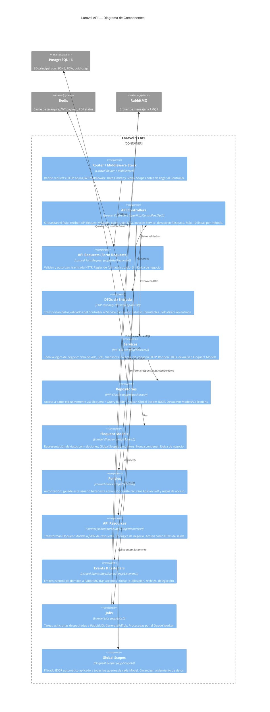

---

### 1.2 Componentes — React 19 SPA (Frontend)

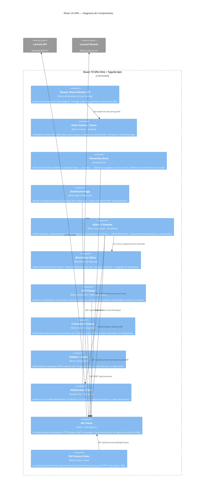

---

### 1.3 Componentes — Queue Worker (Procesador Asíncrono)

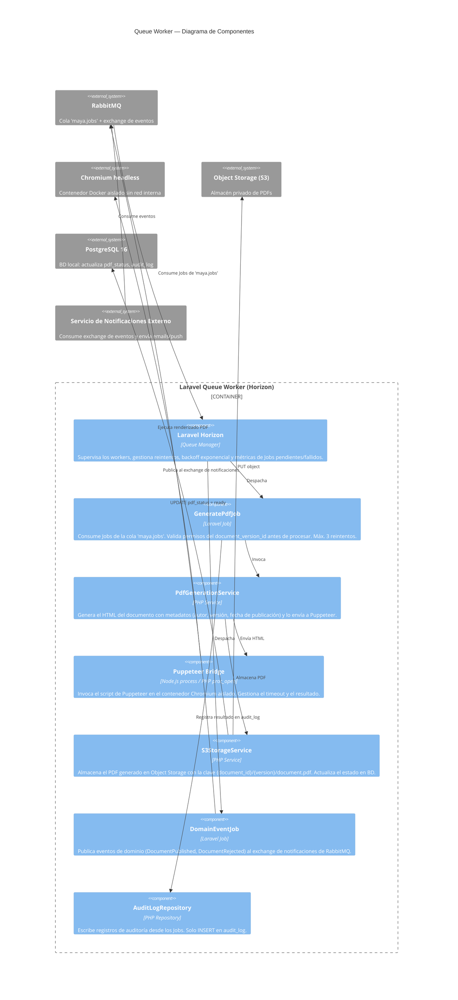

---

## 2. Diagramas de Flujo — Procesos Críticos del Dominio

### 2.1 Flujo de Autenticación JWT (Zero Trust)

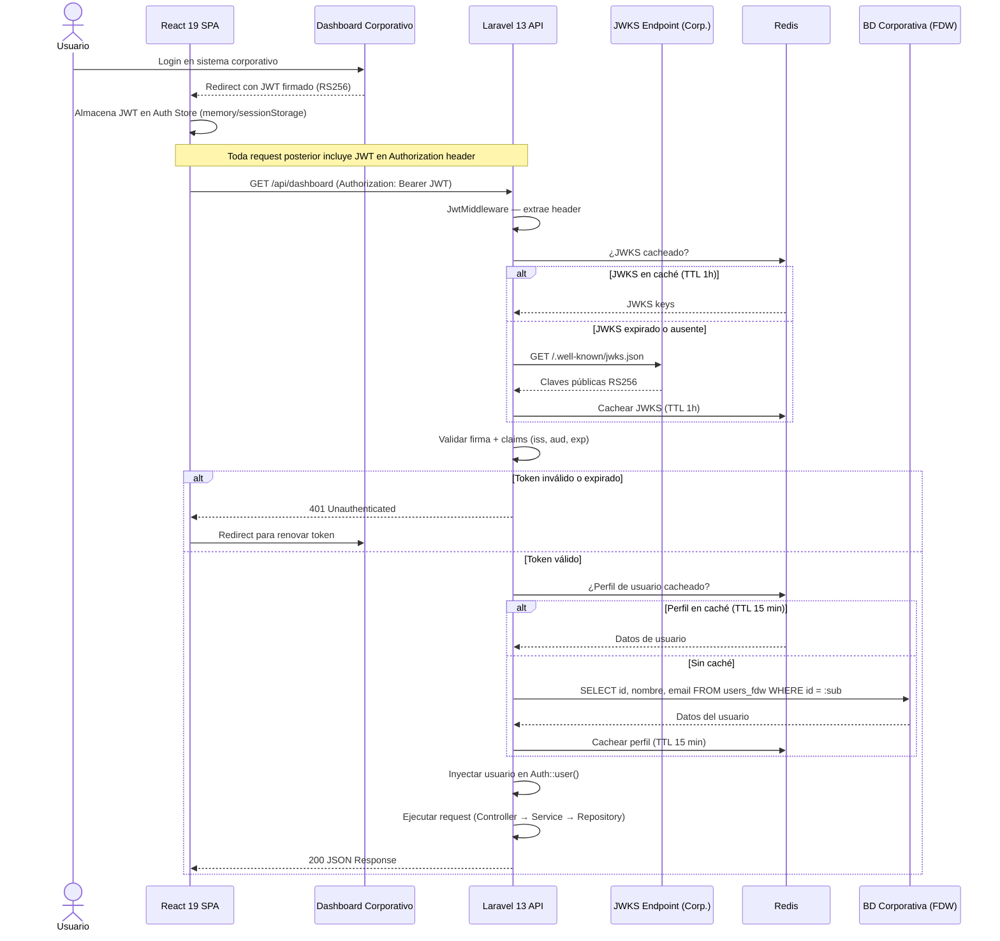

---

### 2.2 Flujo del Ciclo de Vida de un Documento

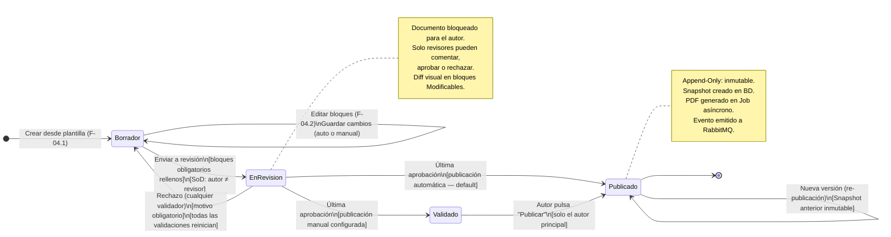

---

### 2.3 Flujo de Revisión con N Validadores (Síncrono vs Asíncrono)

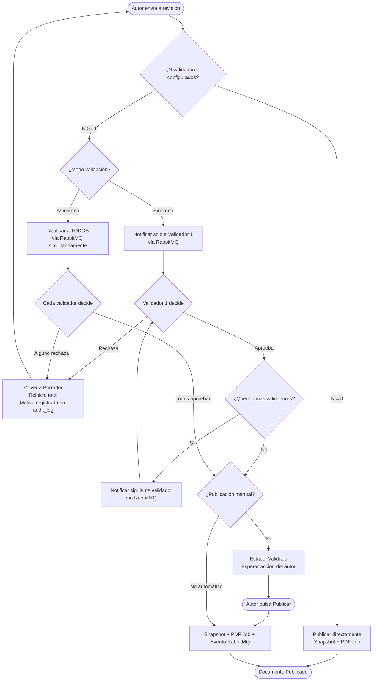

---

### 2.4 Flujo de Generación PDF Asíncrona

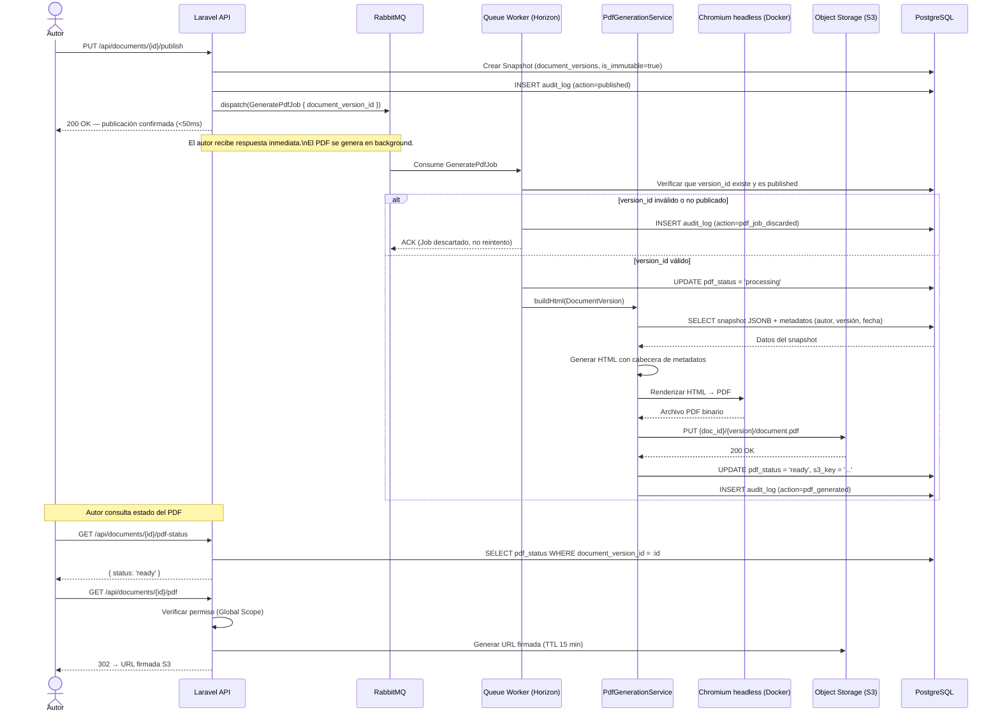

---

### 2.5 Flujo de Colaboración en Tiempo Real (Block Locking)

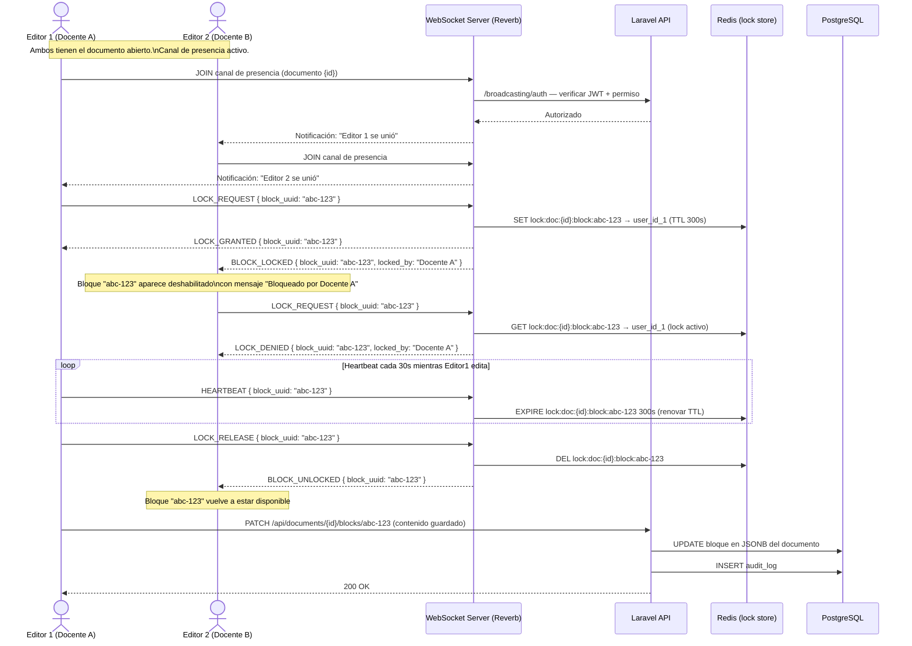

---

### 2.6 Flujo de Delegación de Documento

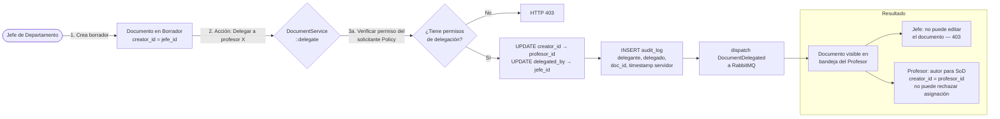

---

### 2.7 Flujo de Prevención IDOR (Global Scopes)

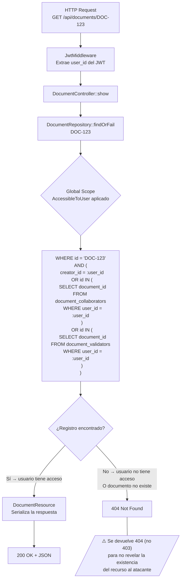

---

## 3. Mapa de Dependencias entre Servicios del Backend

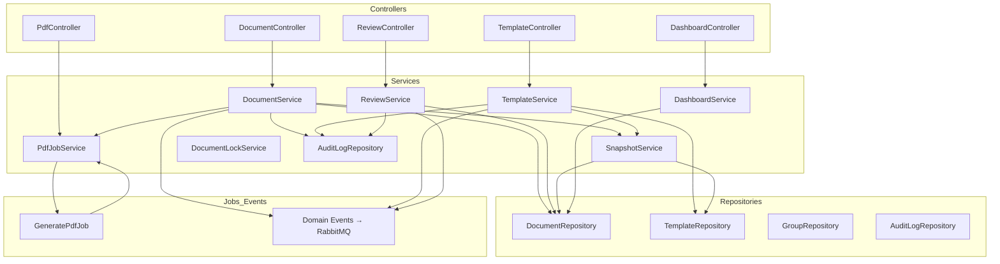

---

## 4. Modelo de Datos Simplificado (Entidades Principales)

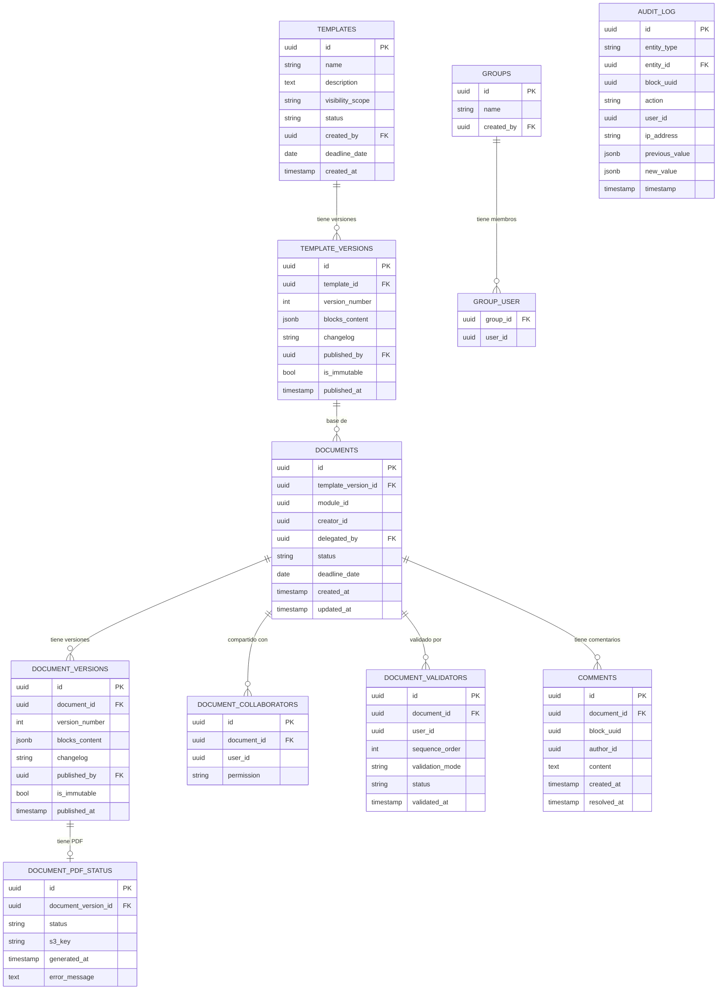
